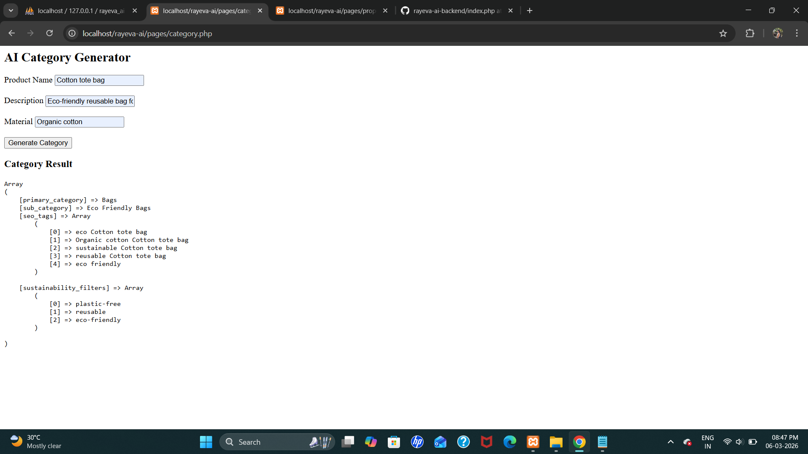
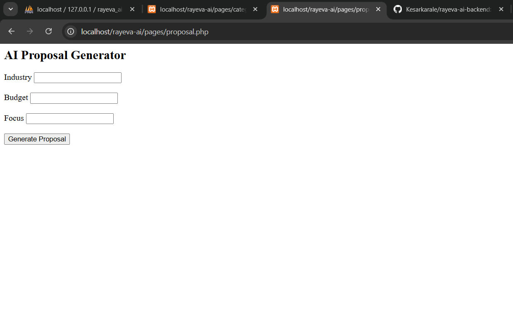
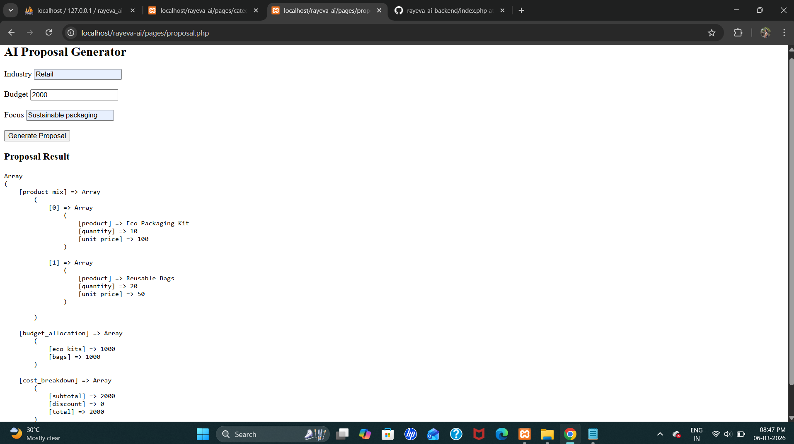

# Rayeva AI Systems – PHP AI Modules

## 📌 Project Overview

This project implements two AI-powered modules for the **Rayeva AI System** using PHP and MySQL.
The goal of the system is to automate product categorization and generate sustainability proposals for businesses.

The project demonstrates how AI-based logic can be integrated into backend systems to produce structured outputs and assist in business decision-making.

---

# 🚀 Modules Implemented

## 1️⃣ AI Auto Category & Tag Generator

This module automatically generates product categories and SEO tags based on product information.

### Input

* Product Name
* Description
* Material

### Output

* Primary Category
* Sub Category
* SEO Tags
* Sustainability Filters

### Example Output

```id="d1w9qk"
Array
(
    [primary_category] => Bags
    [sub_category] => Eco Friendly Bags
    [seo_tags] => Array
        (
            [0] => eco bag
            [1] => cotton bag
            [2] => sustainable bag
            [3] => reusable bag
        )

    [sustainability_filters] => Array
        (
            [0] => plastic-free
            [1] => reusable
            [2] => eco-friendly
        )
)
```

---

## 2️⃣ AI Smart B2B Proposal Generator

This module generates sustainability product proposals based on industry requirements and available budget.

### Input

* Industry
* Budget
* Focus

### Output

* Product Mix
* Budget Allocation
* Cost Breakdown
* Impact Summary

### Example Output

```id="l9v1ac"
Array
(
    [product_mix] => Array
        (
            [0] => Array
                (
                    [product] => Eco Packaging Kit
                    [quantity] => 10
                    [unit_price] => 100
                )

            [1] => Array
                (
                    [product] => Reusable Bags
                    [quantity] => 20
                    [unit_price] => 50
                )
        )

    [budget_allocation] => Array
        (
            [eco_kits] => 1000
            [bags] => 1000
        )

    [cost_breakdown] => Array
        (
            [subtotal] => 2000
            [discount] => 0
            [total] => 2000
        )

    [impact_summary] => This proposal promotes sustainable packaging and reduces plastic usage.
)
```

---

# 🧠 AI Prompt Design

Example prompt used for the category generation:

```id="x6qk2s"
Product Name: Cotton Bag
Description: Student bag
Material: Cotton

Return JSON with:
primary_category
sub_category
seo_tags
sustainability_filters
```

Example prompt for proposal generation:

```id="c6szbx"
Industry: Retail
Budget: 2000
Focus: Sustainable packaging

Return JSON with:
product_mix
budget_allocation
cost_breakdown
impact_summary
```

---

# 🏗 System Architecture

The project follows a modular architecture to separate logic and presentation.

```id="1z7jse"
User Interface (Pages)
        ↓
Business Logic (Modules)
        ↓
AI Service Layer
        ↓
Database Storage
```

---

# 📂 Project Structure

```id="p8ctgl"
rayeva-ai
│
├── config
│   └── db.php
│
├── modules
│   ├── categoryModule.php
│   └── proposalModule.php
│
├── pages
│   ├── category.php
│   └── proposal.php
│
├── services
│   └── aiService.php
│
├── index.php
└── README.md
```

---

# 🛠 Technologies Used

* PHP
* MySQL
* HTML / CSS
* cURL (API integration)

---

# ⚙️ Setup Instructions

1. Install **XAMPP** or any PHP server.
2. Place the project folder inside:

```id="0t48op"
htdocs/
```

3. Create database:

```id="g78h13"
rayeva_ai
```

4. Create table:

```id="8j0a71"
products
```

5. Run project in browser:

```id="dke6qx"
http://localhost/rayeva-ai
```

---

# 📸 Screenshots

### Category Generator

### Category Output


### Proposal Generator


### Proposal Output

---

# 🎥 Demo Video

Include a **3–5 minute demo video** showing:

1. Category generation
2. Proposal generation
3. Output results
4. Database storage

---

# 👩‍💻 Author

**Kesar Karale**
Regal College of Technology & Management
SNDT University

---

# 📄 License

This project is developed for educational and assignment purposes.
